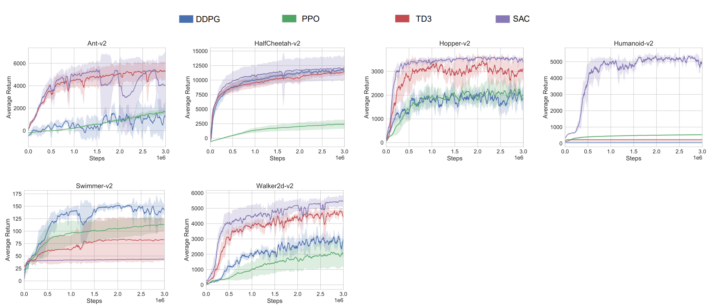
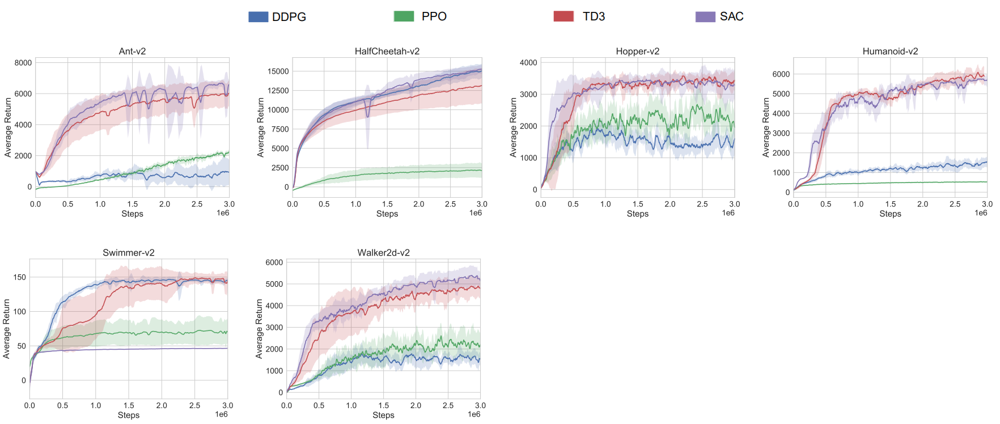
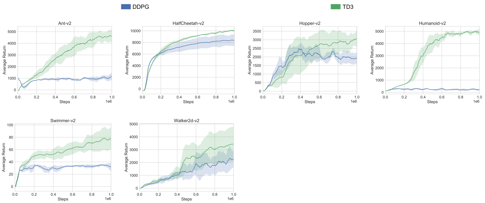
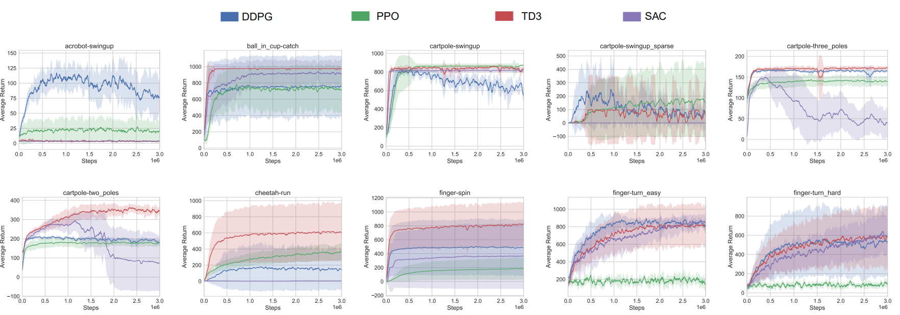
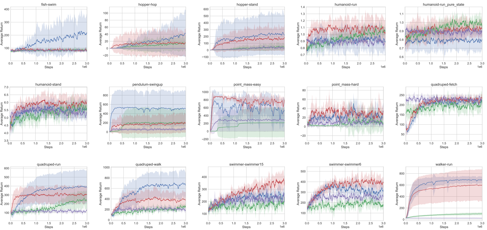

Benchmark data (i.e., [DeepMind Control Suite](https://arxiv.org/abs/1801.00690) and [MuJoCo](http://www.mujoco.org/index.html)) for RL.<br>
All baseline algorithms were running based on the code repository from: ① [Spinning Up repository](https://github.com/openai/spinningup) / ② [Fujimoto TD3 repository](https://github.com/sfujim/TD3) / ③ QingLi Implementation.<br>
Baseline algorithms are listed as below:
- [Deep Deterministic Policy Gradients (DDPG)](https://arxiv.org/abs/1509.02971)
- [Proximal Policy Optimization (PPO)](https://arxiv.org/abs/1707.06347)
- [Soft Actor-Critic (SAC)](https://arxiv.org/abs/1801.01290)
- [Twin Delayed Deep Deterministic Policy Gradients (TD3)](https://arxiv.org/abs/1802.09477)


#### Plot results
```bash
# eg. Notice: `-l` denotes labels, and `-s` represents smoothing value.
python spinupUtils/plot.py \
    MuJoCo-3M/SpinningUp/DDPG/DDPG-Hopper-v2 \
    MuJoCo-3M/SpinningUp/PPO/PPO-Hopper-v2 \
    MuJoCo-3M/SpinningUp/TD3/TD3-Hopper-v2 \
    MuJoCo-3M/SpinningUp/SAC/SAC-Hopper-v2 \
    --env Hopper-v2 \
    -l DDPG PPO TD3 SAC -s 10
```

## MuJoCo-3M
Including `Ant-v2`, `HalfCheetah-v2`, `Hopper-v2`, `Humanoid-v2`, `Swimmer-v2`, `Walker2d-v2`.

- Code of baseline algorithms is from [Spinning Up repository](https://github.com/openai/spinningup), the agents are running for 3 million time steps.


- Code of baseline algorithms is from QingLi Implementation, the agents are running for 3 million time steps.


## MuJoCo-1M
Including `Ant-v2`, `HalfCheetah-v2`, `Hopper-v2`, `Humanoid-v2`, `Swimmer-v2`, `Walker2d-v2`.

- Code of baseline algorithms is from [Fujimoto TD3 repository](https://github.com/sfujim/TD3), the agents are running for 1 million time steps by default.


## DMControlSuite-3M
Including `acrobot-swingup`, `ball_in_cup-catch`, `cartpole-swingup`, `cartpole-swingup_sparse`, `cartpole-three_poles`, `cartpole-two_poles`, `cheetah-run, finger-spin`, `finger-spin`, `finger-turn_easy`, `finger-turn_hard`, `fish-swim`, `hopper-hop, hopper-stand`, `humanoid-run`, `humanoid-run_pure_state`, `humanoid-stand`, `pendulum-swingup`, `point_mass-easy`, `point_mass-hard`, `quadruped-fetch`, `quadruped-run`, `quadruped-walk`, `swimmer-swimmer6`, `swimmer-swimmer15`, `walker-run`.

- Code of baseline algorithms is from [Spinning Up repository](https://github.com/openai/spinningup), the agents are running for 3 million time steps.


<br>

### citation
```bash
@misc{QingLi2021continuousbenchmark,
  author = {Qing Li},
  title = {Continuous Control Benchmark of DeepMind Control Suite and MuJoCo},
  year = {2021},
  publisher = {GitHub},
  journal = {GitHub repository},
  howpublished = {\url{https://github.com/LQNew/Continuous_Control_Benchmark}}
}
```
